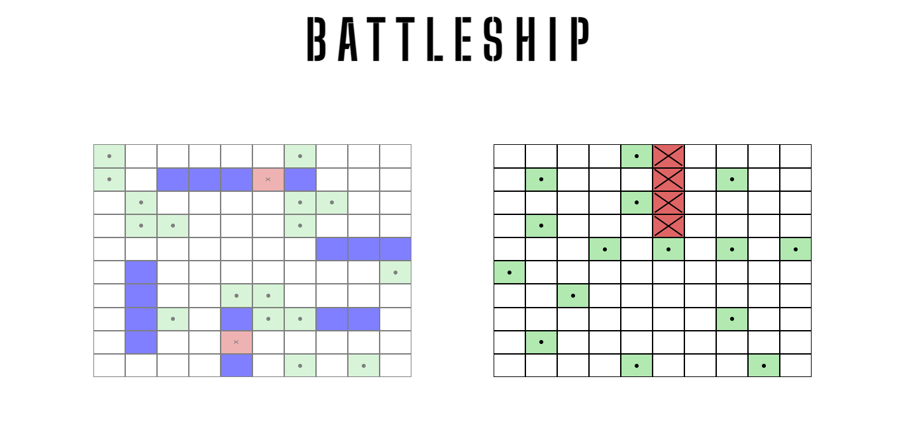

<h1 align = 'center'>Battleships</h1>

This web application offers a thrilling gaming experience, allowing users to strategically place their fleet of ships and engage in epic naval battles against an AI opponent. Created as a part of [The Odin Project](https://www.theodinproject.com/) curriculum

## Project Overview

- **Project Name**: Battleships
- **URL**: [Battleship](https://khaled0p.github.io/Battleship/)
- **Version**: 1.0.0
- **Maintainer**: [Khaled AbdRahem](https://github.com/Khaled0P/)

## Introduction

Battleships is a classic game of strategy and cunning. The Battleships Website project brings this beloved board game to the digital realm, offering a user-friendly and immersive experience. Challenge your strategic thinking as you position your fleet on the grid, anticipate your AI opponent's moves, and engage in fierce naval battles.

This project follows a Test-Driven Development (TDD) approach to ensure the quality and reliability of our code. TDD involves writing tests first and then writing code to make those tests pass, resulting in a well-tested and robust application.

## Features

- Strategically place your fleet on the game board.
- Engage in turn-based gameplay against an AI opponent.
- Fire salvos and track hits and misses.
- Enjoy a dynamic and challenging gaming experience.

## Test-Driven Development (TDD)

Test-Driven Development (TDD) is an integral part of the project development process. I follow a rigorous TDD approach to ensure the reliability and correctness of my code. Here's how I implement TDD:

- I start by writing tests that define the expected behavior of the code.
- These tests act as a blueprint for the features or functionality I plan to implement.
- I then write code to make the tests pass while keeping the codebase clean and maintainable.
- Continuous testing and refactoring help maintaining a high level of code quality throughout the development process.

The commitment to TDD ensures that my project is robust, well-tested, and ready to meet the expectations of our users. also to meet the requirements of the project

## Built With

- **JavaScript** - The primary programming language used in this project.
- [Jest](https://jestjs.io/) - Testing framework for writing and running tests.
- [Webpack](https://webpack.js.org/) - Build tool for managing dependencies and bundling assets.
